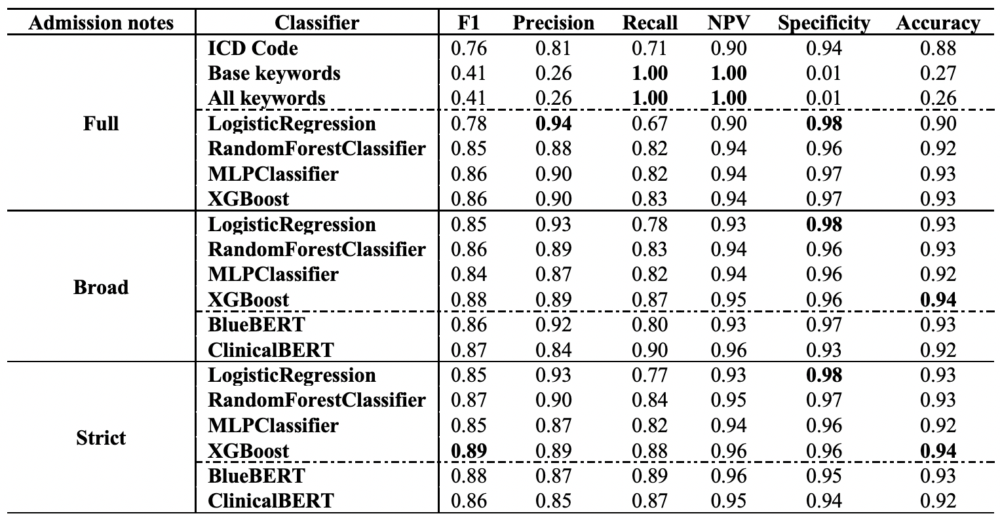
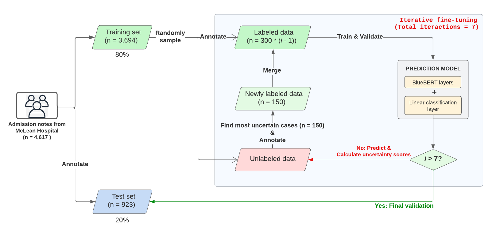
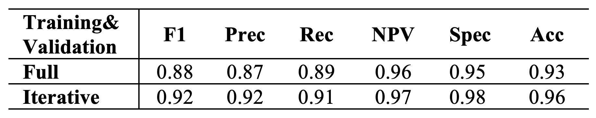

# Psychosis identification from initial admission notes
## Step 1. Identifying Psychosis Episodes in Admission Notes: Rule-based Methods, Machine Learning, and Pre-Trained Language Models
### Abstract
**INTRODUCTION**\
Keyword-based searches and rule-based approaches are challenging to make use of identifying psychosis in admission notes. Inefficiencies could compromise treatment and early intervention. Our study investigates whether natural language processing via rule-based techniques, machine learning algorithms, and pre-trained language models (PLM) can improve admission note psychosis episode detection.

**MATERIALS AND METHODS**\
**_Study Settings and Data Curation_**: This approved McLean Hospital study examined 4,617 first mental admission notes from 2005 to 2019 (MGB Human Research Committee procedure). Psychiatrists examined each note for psychotic development. Identifying information was removed. The data were split into training/test sets by an 80:20 ratio. For non-rule-based models, the training set was further divided by an 80:20 ratio into training and validation sets.\
**_Study Design_**: Two rule-based methods were employed to identify patients with psychosis: ICD code assignment at discharge and keyword matching based on terms derived from electronic health records and clinical texts. The ICD codes were applied during discharge, while the keyword approach utilized terms exclusively from admission notes [1], which were carefully re-grouped by a weighing algorithm and reviewed by two psychiatrists (AS and LM) for our study. This step selected and categorized keywords into the strictly relevant group and the broadly relevant group for feature selection in building machine learning prediction models. More details can be found in Appendix A.
Four machine learning classifiers (Logistic Regression, Random Forest, Multilayer Perceptron, and XGBoost) in conjunction with Term Frequency-Inverse Document Frequency (TF-IDF) for feature extraction were implemented. TF-IDF was particularly valuable in emphasizing psychosis-indicative terms and reducing the significance of non-informative terms, which is especially advantageous in the mental health field. \
Finally, PLMs using BERT architecture given their wide adoption and lite weights, specifically Bio_ClinicalBERT and BlueBERT, were evaluated. 
Three sets of experiments were performed for machine learning algorithms—using all features from full admission notes (full), features extracted from notes with a broader keyword range (broad), and features extracted from notes with strictly relevant keywords (strict). Given the input length limit of 512 tokens, PLM experiments were conducted under broad and strict settings. Performance assessment included metrics like F1 score, sensitivity, specificity, accuracy, and area under the curve, supported by bootstrap resampling (n = 1,000) for confidence interval estimation.\

**RESULTS**\
Table 1 shows the results. Rule-based algorithms like ICD Code-based approaches performed well on medical admission notes, with F1 score of 0.761. Keyword-matching had restricted performance. Machine learning methods like XGBoost surpassed others across note subsets with the best F1 score of 0.8881, outperforming ICD code performance on discharge. BlueBERT and ClinicalBERT were proficient but did not outperform XGBoost in the F1 score. Both types of models performed differently when trained on all keywords or a base keyword collection, underscoring the relevance of feature selection.\

\
Table 1. Algorithm Performance rounded to the nearest hundredth.

**DISCUSSION & CONCLUSION**\
Comparative studies are important in scientific research as they provide a systematic way to evaluate and contrast different methods or phenomena under similar conditions. In the context of psychosis episode detection, our study allows for the assessment of the relative effectiveness of various algorithms using admission notes. We found that machine learning methods, notably XGBoost, outperformed both rule-based and pre-trained language models in identifying psychosis episodes in admission notes, achieving the highest F1 score of 0.8881. It's worth noting that BlueBERT delivered competitive results, with an F1 score of 0.8841. 
performance, effectively reducing noise in the data. This observation highlights the importance of interpretable expert knowledge in building predictive models. To gain deeper insights, further investigation is required to conduct error analysis and assess the importance of features in the model. 
Through this study, we aim to provide future research with insights into the most efficient methods for detecting psychosis in clinical settings. This could lead to enhanced diagnostic processes and, ultimately, better patient outcomes.

### Appendix A
We adopted the keyword lists developed in a 2019 study by Viani, et al [1], which trained various models on use-case-specific EHR texts from early psychosis intervention services, institution-specific discharge summaries, and external clinical texts and also experimented with pre-trained embeddings from MEDLINE/PubMed. Their methodology encompassed diverse data sources, ensuring broad applicability and robustness in generating relevant terms, to develop an automated NLP model that could be applied to diverse settings outside of McLean Hospital. 
The paper presented three keyword sets: the foundational 26 base seed terms related to psychosis symptoms and two generated lists segmented into unigrams and bigrams. Each term from the generated lists was manually categorized as a Relevant Term (RT), a Potentially Relevant Term (PT), or Not Relevant (NT). Guided by this classification, we formulated two distinct rules, which we refer to as “strict” and “broad”, to construct our keyword lists from the combined unigram and bigram terms:
- Strict Rule: A term was considered strictly relevant only if it was unanimously identified as an RT by both annotators.
- Broad Rule: A term was deemed broadly relevant if either (1) one annotator marked the term as an RT while the other marked it as a PT or NT, or (2) both annotators agreed on marking the term as a PT.\
Following this, we integrated the terms filtered via these criteria with the original seed terms. 
During post-processing, underscores were substituted with spaces, and plural forms were streamlined. To further optimize for reducing computation complexity, both lists were refined to exclusively feature terms with the shortest unique substrings. We also removed the term “systematised delusional” and moved the term “persecutory” from broad to strict. Table 2 shows the final keyword lists.

| Base keywords | Strict keywords (excluding base) | Broad keywords  (excluding base and strict) |
|----------------|----------------------------------|-------------------------------------------|
| circumstantial, clang association, delusion, derailment, flight of idea, formal thought disorder, hallucination, knights move thinking, loosening of association, paranoia, persecutory idea, psychosi, psychotic, running commentary, somatic passivity, tangential, thought alienation, thought block, thought disorder, thought interference | abnormal belief, abnormal perception, deluded, hallicinat, hallucat, halluciant, halluciat, hallucinat, hallucnat, halluicnat, halucinat, passivity, persecutory, though broadcast, thought blocked, thought broadcast, thought disordered, thought echo, thought insertion, thought withdrawal | aggitation, altered perception, auditory disturbance, bizarre behaviour, bizarre belief, bizarre idea, clanging, delusion-like, delusionary disjoint, disordered, disorganis, echolalia, elated mood, elation, flat affect, ftd, grandiose, guarded, halluc, highly agitated, highly aroused, highly distressed, hostile, hostility, hypomanic, illogical, illusion, incoherence, incoherent, jealousy, knights move, loose association, manic, mute, neologism, nihilistic idea, odd belief, olfactory, over inclusive, over valued, overvalued, paranoid, parnoid, perceptual abnormalit, perceptual disturbance, pressured, referential, religiou, religious theme, running commentarie, seeing shadow, seeing shape, somatic, special abilitie, suspicion, suspicious guarded, suspiciousne, tactile, tangencial, tangenital, third person, unusual belief, unusual experience, word salad |

Table 2. Psychosis-related keyword lists generated from previous research.

### References
```[1] Viani N, Patel R, Stewart R, Velupillai S. Generating positive psychosis symptom keywords from electronic health records. Paper presented at: Conference on Artificial Intelligence in Medicine in Europe2019.```


## Step 2. Psychosis Identification on Admission Notes via Semi-Supervised Learning 
**INTRODUCTION**\
A previous portion of this project has established that deep learning-based classifiers significantly improve the identification process for psychosis, outperforming traditional keyword-based methods, ICD code reliance, and various machine learning approaches. However, the intensive labor required for data annotation and the inherent opacity of the learning algorithms continue to present considerable challenges, particularly in terms of interpretability. To address these issues, the present study advances our prior efforts by integrating a semi-supervised training strategy with topic modeling analysis to understand the learning process of the model. 

**MATERIALS AND METHODS**\
**_Study Settings and Data Curation_**: This study (protocol approved by the MGB Human Research Committee) is conducted at McLean Hospital. We collected the initial psychiatric admission notes of 4,617 patients from the years 2005 to 2019 (psychosis vs. non-psychosis ~= 0.76:0.24).\
Considering the limitation of our text embedder that accepts 512 tokens per input at maximum, we processed the notes by identifying and concatenating pertinent sentences using a dictionary developed in a parallel work. Further details of this procedure can be found in Step 1 Appendix.\
The dataset was divided into two parts: a test set and an iterative training set. The test set was annotated at the outset, while the training set is annotated progressively during the iterative learning process.\
**_Study Design_**: The iterative training process ((Fig. 1) begins with the division of the dataset of admission notes into a training set comprising 80% of the data (3,694 cases) and a test set comprising the remaining 20% (923 cases). The test set is annotated immediately for later evaluation. For the training set, an initial sample is randomly selected and annotated. This labeled data is then used to train and validate (split with an 80:20 ratio) a prediction model composed of BlueBERT pretrained layers and a linear classification layer.
The model undergoes iterative fine-tuning, where in each iteration, it predicts and calculates uncertainty scores for unlabeled data with the entropy. The most uncertain cases (top 150) are then annotated by experts to create a newly labeled, which is then is merged with the previously labeled data, and the model is retrained and validated with this expanded dataset.
Latent Dirichlet Allocation (LDA) topic analysis is applied to scrutinize the case types within the initially randomly selected cases, as well as those chosen by the model in each iteration. \

\
Figure 1.   Iterative training process for psychosis indentification. i denotes number of iterations. F1 was for model evaluation during trarining & validation due to class imbalance.

**RESULTS**\
Figure 2 illustrates the F1 score progression on the validation set in relation to the number of training and validation samples used. The trend indicates a consistent improvement in the score with each iteration of training. Table 1 presents the final performance metrics of the classification model when trained iteratively versus when trained on the full dataset. Remarkably, the iterative training approach, which utilizes approximately one-third of the training data, achieves better results, with an F1 score of 0.92 compared to 0.88 from the model trained on the full dataset.\
Topic modeling reveal an evolving trend of training data themes. Initial rounds emphasize psychotic symptoms and hallucinations, indicating an acute focus on immediate mental health concerns. As the iterations progress, there was a noticeable shift towards broader themes like patient history and functioning. 

\
Figure 2. F1 Score Progression on Validation Sets.

\
Table 1. Algorithm Performance on the Test Set.

**DISCUSSION & CONCLUSION**\
The study demonstrates that an iterative training approach on a carefully selected subset of data can enhance the performance of a deep learning classifier for identifying psychosis episodes in admission notes while substantially reducing annotation work. This result suggests that training on all available data may introduce noise, whereas focusing on the most uncertain cases allows the model to concentrate on features that are more indicative of the target outcome.\
The topic modeling results reflect an adaptive and iterative process that mirrors the classifier’s learning, where the initial focus on acute symptoms transitions to include a broader and more comprehenssive assessment of patient history and functioning, mirroring the classifier's refinement in identifying relevant features.\
Clinically, this implies that the model is not only learning to detect psychosis with high accuracy but is also aligning its learning trajectory with the clinical understanding of psychosis, which is multifaceted and evolves over time. Practically, this approach enhances the efficiency and transparency of psychosis detection, potentially supporting clinicians in making more informed decisions with a higher degree of confidence. The iterative training methodology, therefore, does not merely improve a metric; it could also lead to more clinically meaningful models that reflect the nuanced reality of psychiatric evaluation, ultimately contributing to better patient outcomes.
